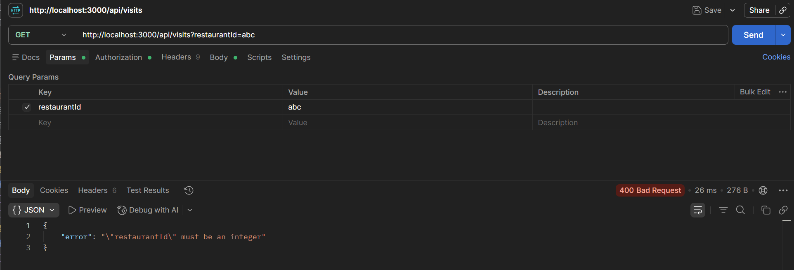

# Write-up

## 1. What did you build for Part B, and why that?
I decided to use the existing visits table and associated helpers that were already in the code to build an API for the 
"Brennen"'s visits. This includes endpoints to `GET` multiple visits (all or per restaurant), `GET` specific visits, 
`POST` new visits, and `PATCH` the notes for an existing visit. After finishing the API routes, I added a new NextJS page
and created a UI to view visits for specific restaurants. 

I built this for Part B because there was already some architecture in place for this, and because the project was named
"Feeding Brennen", so it made sense to be able to see information about restaurants.

## 2. What did you decide, and what did you rule out?
I was debating where to put the routes for the visits API (nested in "/api/restaurant", top-level "/api" or a mix). I
ended up placing the route handlers in a top level "/api/visits" directory since I wanted the API to reflect that 
restaurants and visits are separate objects in our database (although they have a foreign key relation).

I opted to not include a `DELETE` endpoint for visits, since a visit is a historical record (equivalent of a log) and we
shouldn't be able to undo them.

When adding the `?restaurantId` query parameter to the `GET /api/visits` route handler, I didn't reuse the `parseVisitID()`
function used on other routes, since it throws a `NotFoundError` (our route was found, but the query parameter is not correct). On this route in specific, we want to prioritize listing
visits over the filtering, so as long as `?restaurantId` is a valid integer that could potentially be a `SERIAL`, we can 
continue with our SQL query. Our goal with the parsing for that query parameter is just to ensure that the datatype is correct.

## 3. Where did you cut corners?
Originally, I wanted to add a form to log visits, but I ran out of time. I created helper functions for this in 
`apiClient.ts`, but they aren't being used. If I were to create this form, I would have used React `useState` hooks to 
track responses and loading states and the `onSubmit` event handler on `<form>` to call a function that in turn calls the 
API endpoint. If server actions were allowed, I would have also considered setting an action on a `<form>` in a server component.

I also thought of adding a rating system so the ratings shown for restaurants could be pulled from actual ratings instead
of a db column. I did not have time for this, and ended up focusing on the visit API and server rendered page instead of a
completely separate feature.

---

## Part B: routes

| Method and path                   | What it does                                   | Success          | Errors                                                                        |
| --------------------------------- | ---------------------------------------------- | ---------------- | ----------------------------------------------------------------------------- |
| `GET /api/visits?restaurantId={rid}` | List visits, optionally filtered by restaurant | `200` + `Visit[]` | `400` if `restaurantId` isn't a positive integer                              |
| `POST /api/visits`                | Log a new visit                                | `201` + `Visit`  | `400` on invalid body, malformed JSON, or a `restaurantId` that doesn't exist |
| `GET /api/visits/:id`             | Fetch one visit                                | `200` + `Visit`  | `404` if `:id` isn't a positive integer or no such visit                      |
| `PATCH /api/visits/:id`           | Update a visit's `notes`                       | `200` + `Visit`  | `400` on invalid body; `404` if no such visit                                 |

`Visit` shape:

```jsonc
{
  "id": 1,
  "restaurantId": 1,
  "date": "2026-01-12",          // calendar date, YYYY-MM-DD
  "amountSpent": 42.5,           // number, not a string
  "notes": "Burger night.",      // string | null
  "createdAt": "2026-01-12T00:00:00.000Z"
}
```

**`POST /api/visits`**

```jsonc
// request
{ "restaurantId": 1, "date": "2026-04-01", "amountSpent": 25.5, "notes": "Lunch" }

// 201 response
{ "id": 4, "restaurantId": 1, "date": "2026-04-01", "amountSpent": 25.5, "notes": "Lunch", "createdAt": "..." }
```

**`PATCH /api/visits/:id`**

```jsonc
// request: notes only
{ "notes": "Updated note" }

// 200 response: the full updated Visit
```

## Schema changes
No schema changes were made.

## How I verified this
I added a new tab to Postman and edited the route every time I worked on an endpoint. I used the example curl commands 
provided to base my test API calls off (very large numbers for IDs, missing body (required and option) fields, strings 
instead of numbers, etc...). 



**Part A** - the contract table in CHALLENGE.md, every row including the error
cases:

```bash
# e.g.
curl -i http://localhost:3000/api/restaurants          # 200 + array
curl -i http://localhost:3000/api/restaurants/99999    # 404
curl -i http://localhost:3000/api/restaurants/abc      # 404
curl -i -X POST http://localhost:3000/api/restaurants \
  -H 'Content-Type: application/json' \
  -d '{"name":"Out Of Range","rating":6}'              # 400
```

**Part B** - the equivalent cases for what you built:

```bash
curl -i http://localhost:3000/api/visits                             # 200 + array
curl -i http://localhost:3000/api/visits?restaurantId=1              # 200 + array
curl -i http://localhost:3000/api/visits?restaurantId=a2             # 400
curl -i http://localhost:3000/api/visits/99999                       # 404
curl -i http://localhost:3000/api/visits/abc                         # 404
curl -i -X POST http://localhost:3000/api/visits \
  -H 'Content-Type: application/json' \
  -d '{"restaurantId":-1,"date": "04-12-3000","amountSpent": 0}'     # 400
curl -i -X POST http://localhost:3000/api/visits \
  -H 'Content-Type: application/json' \
  -d '{"restaurantId":1,"date": "2026-09-09","amountSpent": 38.42}' # 201
curl -i -X PATCH http://localhost:3000/api/visits/1 \
  -H 'Content-Type: application/json' \
  -d '{"notes": ""}'                                                 # 400
curl -i -X PATCH http://localhost:3000/api/visits/1 \
  -H 'Content-Type: application/json' \
  -d '{"notes": "test"}'                                             # 200
```

## Known issues / what I'd do next
- The `PATCH /api/visits/{id}` endpoint requires a note field, but the current check throws a `ValidationError` if an 
empty string is passed. This means we can't clear a note for a visit, which should be supported since the database column
is not `NOT NULL`.
- Add a check for the `?restaurantId` query parameter to check whether the restaurantId exists. This can be done just by 
`SELECT 1 FROM restaurants where id = $1`, but as mentioned earlier, I opted to not check for this.